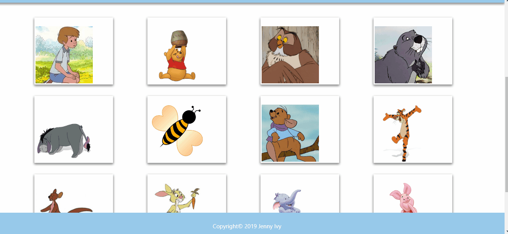

## 'Winnie the Pooh' Memory Game

### Overview

This is a memory game created with React. This project requires breaking up the application's UI into components, managing component state, and responding to user events.

The application renders different images of Simpsons characters to the screen. Each image listens for click events. Every time an image is clicked, the images rendered to the page shuffle themselves in a random order. The application keeps track of the user's score. The user's score is incremented when clicking an image for the first time. But if the user clicks the same image more than once, their score goes back to 0.

